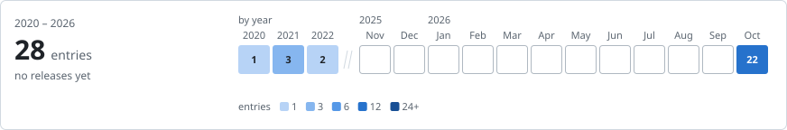

# Meta Search Engine

     

[Quick start](#quick-start) · [Architecture](#architecture) · [Change history](#change-history)

<!-- project-control:section=overview -->
## Overview

Meta Search Engine is a single-page search front end, created with React in winter term 2021.

- It was built to gather results from several search engines into one list: a home page with a
  search box, a results page with a websites filter and a search-engine filter, and **My Pages**, a
  collection of saved results.
- Everything it keeps stays in the browser.

It searches the **live web** through Tavily, a web search service with a free monthly allowance.

- The Tavily key stays with the local development server, which passes each query on.
- Google and Bing are shown but unavailable: only Google was ever connected, through the ValueSERP
  search API; that request was commented out in March 2021 and removed on 2026-10-02.

<!-- project-control:section=overview -->
## Capabilities

- **Search:** Type a query on the home page and read the ten live results Tavily returns, in its order, with the search words in bold.
- **Filters:** Hide a website's results by unticking it, and switch the web results on and off.
- **Saved websites:** Mark a result as a favourite, keep it in this browser, see it listed first and highlighted, and open or remove it from My Pages.
- **Where it stands:** A 2021 prototype whose two known bugs and two layout bugs were fixed on 2026-10-01, with live results since 2026-10-02; pagination, the Bing filter and Google domain settings were never built.

<!-- project-control:section=ignore -->
### In detail

The feature list as the project recorded it at Version 3.31 in April 2021.

- Its two known bugs, and two layout bugs found later, were fixed on 2026-10-01.
- Since 2026-10-02 saved websites have been listed first, and the results come from the live web
  through Tavily, which the search-engine filter switches on and off.

#### Completed

- Search bar
- Search results
- Websites filter
- Save favourite websites
- Search engine filter (Google)
- Saved websites collection
- Saved websites presented first with colored background

#### In progress

- Pagination
- Search engine filter (Bing)

#### Known bugs

None known.

#### Not yet implemented

- Customized searching on google domain,location,gl,hl

#### Current state

Checked on 2026-10-02 with Node.js 22.

- **Build:** Vite serves the app with `npm start` and builds it with `npm run build`.
- **Search:** every query asks Tavily for 10 live results through the development server and lists
  them in Tavily's order. Without a Tavily key, or once the month's free searches are used up, the
  results page says why. Google and Bing are unavailable.
- **Tests:** `npm test` runs 53 tests: the app's pages, filters, favourites and saved state
  against a stand-in for Tavily, the live search's answers and refusals, and the snippets with
  their bold search words.

## Quick start

Requires Node.js 22.22 or newer, and npm. Live search needs a free API key from
[Tavily](https://tavily.com). Run every command from this folder.

```bash
npm install
npm start
```

1. First create `.env.local` in this folder with the line `TAVILY_API_KEY=` followed by your Tavily
   key. Only the development server reads it, and the page never receives it; the server restarts
   by itself when `.env.local` changes.
2. `npm start` serves the app at http://localhost:3000; add `-- --port <number>` to use another port.

Each search uses one of Tavily's free monthly searches, 1,000 on the free plan in October 2026.
Without a key, the results page says how to add one.

- `npm run build` writes a production build to `build/`. Live search needs a server that holds the
  key, so a build searches only when `npm run preview` serves it.
- `npm run preview` serves that build at http://localhost:3000, with live search.
- `npm test` runs the tests once.

<!-- project-control:section=workflows -->
## Workflow

```text
Search and filter
Type a query on the home page and press Enter
  ↓
The development server asks Tavily for live results
  ↓
The results page lists Tavily's top ten
  ├─→ Untick a website to hide its results
  └─→ Turn Web off to hide its results

Save a page
Choose Favourite beside a result
  ↓
The result is highlighted and joins the saved list in this browser
  ↓
Saved results lead the list the next time it is drawn
  ↓
Open My Pages from the My Pages link
  ↓
Open a saved page, remove it, or go back to the results
```

<!-- project-control:section=architecture -->
## Architecture

The app runs in the browser. `src/index.jsx` mounts the router, class components draw the three
pages, and every piece of state lives in the browser's local storage. `src/webSearch.js` asks the
development server's `/live/search` address for live results, which `scripts/liveSearch.js` fetches
from Tavily with the key in `.env.local`.

### Frontend & Presentation

| Technology or concept | Use in this project |
|---|---|
| React 19 | Class components draw the home page, the results page and My Pages; function components draw the shared header, the empty states, the addresses and the icons. |
| React Router 8 | `BrowserRouter` maps `/` to the home page, `/results` to the results page and `/favourite` to My Pages; `src/router.jsx` hands each page the current location and a `navigate` function, since class components cannot call the router's hooks. |
| Bootstrap 5 | Its reboot stylesheet supplies the base styles and loads first, so the project's stylesheets draw the pages; the `visually-hidden` helper is copied into `search.css`, and the rest of Bootstrap is not loaded. |
| Bootstrap Icons | Its glyphs mark the buttons and links, inlined as SVG in `src/icons.jsx`; there is no icon package. |
| CSS | The design's colours, type, radii, page width and focus ring are variables at the top of `search.css`, which also styles the header the results page and My Pages share (`src/header.jsx`); `searchResults.css` and `favourite.css` lay out each page. |
| IBM Plex Sans and Mono | The interface and the addresses, counts and labels. The font files ship with the app through the Fontsource packages (Latin subset), so the page loads nothing from Google Fonts; without them, every font falls back to the system font. |

### Data & Storage

| Technology or concept | Use in this project |
|---|---|
| Browser local storage | Through `src/storage.js`, a small module over the browser's `localStorage` that stores each value as JSON, it keeps the current and previous query, the last results and whether live search answered, the websites hidden by the filter, and the saved pages;<br>the module names every key and reads and writes the saved pages. |
| `.env.local` | Holds this computer's Tavily key, read only by the development and preview servers; it is never committed. |

### Integrations & Security

| Technology or concept | Use in this project |
|---|---|
| ValueSERP API | Supplied Google results during development in 2021; the request was removed on 2026-10-02, and the key it carried reads `REDACTED` in the history. |
| Tavily Search API | Supplies the live results, the only hosted service the app talks to.<br>The development and preview servers send each query to Tavily's basic search with the key from `.env.local` and pass only each result's title, address and excerpt to the page.<br>The key never reaches the browser, and the servers answer only the app's own page. |

### Build & Delivery

| Technology or concept | Use in this project |
|---|---|
| Vite | Serves the app for `npm start` and builds it into `build/` for `npm run build`, with `html/` as its public folder; its development and preview servers answer `/live/search`. |
| Vite React plugin | Compiles the JSX and refreshes changed components while the development server runs. |
| Vitest | Runs the tests in `src/` and `scripts/` for `npm test`; in a simulated browser page from jsdom, React Testing Library drives the app through its router against a stand-in for Tavily. |
| Scripts | `scripts/liveSearch.js` is the servers' live search, which asks Tavily. |

## Project structure

| Path | Contents |
|---|---|
| `index.html` | The page Vite serves and builds, which loads `src/index.jsx`. |
| `vite.config.js` | The Vite configuration: the React plugin, the live search, the `html/` public folder, port 3000, the `build/` folder and the test environment. |
| `src/` | The React components (`search.jsx` for the home and results pages, `searchResults.jsx`, `favourite.jsx`, the shared `header.jsx` and `emptyState.jsx`), their stylesheets, the icons, the web search, the addresses in `routes.js`, the local storage in `storage.js`, and the tests. |
| `scripts/` | The servers' live search and its tests. |
| `html/` | The web app manifest, the favicon and the header logo made from the project icon, and the home-page image, a Bing wallpaper the home page credits. |
| `.env.local` | This computer's Tavily key; not committed. |
| `Resources/` | The 1,024-pixel project icon master, kept outside `html/` so the build does not serve it. |
| `CONTRIBUTING.md` | Contribution and numbering rules for the public mirror. |
| `CHANGELOG.md` | The complete change history. |
| `CHANGELOG.svg` | The history strip drawn from the changelog. |

<!-- project-control:section=ignore -->
## Contributing

For source changes, follow the [Meta Search Engine contribution guide](CONTRIBUTING.md).

<!-- project-control:section=history -->
## Change history



**Change-history numbering:** This project uses dated history and does not assign project-level
version or build numbers. Follow the [version and build policy](CONTRIBUTING.md#version-and-build-policy).

The 2021 commits carry the project's own development labels, from V 0.2.1 to Version 3.31. The
records below keep them as history; they are not project versions.

One record per change; complete details and evidence are in [CHANGELOG.md](CHANGELOG.md). Older work dates and Git checkpoints remain labelled when they differ.

**Historical status:** Each record describes its own delivery checkpoint. Later records supersede older pending work or recovery locations; historical checks are not new validation.

| Record | Date | Highlights | Details |
|---|---|---|---|
| Documentation | 2026-10-07 | <ul><li><strong>Documentation:</strong> The rules behind the Capabilities map moved from Usage into Capabilities itself, under one In detail subsection with a heading per map item; Project Control still shows the map alone.</li></ul> | [Full record](CHANGELOG.md#capabilities-in-one-section) |
| Documentation | 2026-10-07 | <ul><li><strong>Documentation:</strong> Capabilities is a map of four labelled lines; the 2021 feature list with its status subsections and the current-state notes moved under Usage.</li></ul> | [Full record](CHANGELOG.md#capabilities-as-a-map) |
| Documentation | 2026-10-06 | <ul><li><strong>Changelog:</strong> The README's Change history opens with a history strip, <code>CHANGELOG.svg</code>, drawn from the changelog: the entries of every period as shaded cells, release months marked, and the span, total and version range beside them.</li></ul> | [Full record](CHANGELOG.md#history-strip) |
| Documentation | 2026-10-06 | <ul><li><strong>Layout:</strong> The line of section links under the title now holds three quick links, Quick start, Architecture and Change history, in place of one for every section; the outline of the whole README is the one GitHub, Obsidian and Project Control provide.</li></ul> | [Full record](CHANGELOG.md#three-quick-links) |
| Documentation | 2026-10-06 | <ul><li><strong>Audit:</strong> The structure table lists the contributor guide and the changelog, the two root documents it lacked.</li></ul> | [Full record](CHANGELOG.md#readme-source-audit) |
| Documentation | 2026-10-06 | <ul><li><strong>History:</strong> The complete change history now lives in <code>CHANGELOG.md</code>, one entry per change with its summary, what changed, what was checked and how it was delivered; the README table keeps the newest ten rows and opens each entry from its Details cell.</li></ul> | [Full record](CHANGELOG.md#changelog) |
| Documentation | 2026-10-05 | <ul><li><strong>Alignment:</strong> The badge row now opens with the platform and names the history mode; the JavaScript badge went, as the Architecture table names the language.</li></ul> | [Full record](CHANGELOG.md#readme-alignment) |
| Documentation | 2026-10-05 | <ul><li><strong>Structure:</strong> Sections follow the order and names every project README now shares, under a contents line; sections were renamed and moved, and no wording was removed.</li></ul> | [Full record](CHANGELOG.md#readme-skeleton) |
| Documentation | 2026-10-05 | <ul><li><strong>Readability:</strong> Long paragraphs, bullets and table cells are now short leads with sub-points, one fact each; no detail was removed.</li></ul> | [Full record](CHANGELOG.md#readme-structure) |
| Maintenance | 2026-10-02 | <ul><li><strong>Name:</strong> The app is MetaData Search Engine on the page, in the browser tab and in the web app manifest.</li><li><strong>Links:</strong> Results and saved pages open at their own address, https included; bold search words now work in accented and Chinese text.</li><li><strong>Filters:</strong> Ticking a website or switching Web no longer adds a browser history entry, switching Web on the home page keeps the typed query, the Web switch keeps its setting across a reload, and submitting the same query again searches again.</li><li><strong>Lighter:</strong> Only Bootstrap's base styles load, the IBM Plex fonts ship with the app instead of coming from Google Fonts, and the page's debug logging is gone.</li></ul> | [Full record](CHANGELOG.md#source-simplification) |
---

<!-- project-control:section=ignore -->
## 🔒 License

**PROPRIETARY SOFTWARE — ALL RIGHTS RESERVED**

Copyright © 2024–2026 Soucieux. All rights reserved.

The original source code, documentation, and other original materials in this repository are proprietary and are not open-source software.

Except where applicable law expressly permits otherwise, no permission is granted to copy, modify, publish, distribute, sublicense, sell, deploy, or create derivative works from these materials, in whole or in part, without prior written authorization from the copyright owner.

Access to this repository does not grant a license. Third-party software and materials remain subject to their respective license terms.

*This private project is not open for external contributions.*
